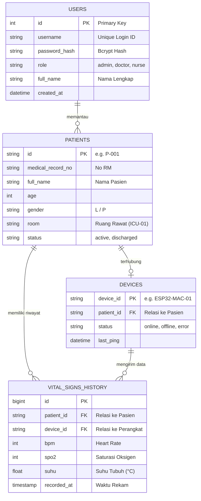

# Panduan Integrasi, Pesan Tim B & C, serta Rekomendasi Database MedIoT

Dokumen ini disusun oleh **Tim A (Frontend)** sebagai panduan resmi dan bahan diskusi integrasi bersama **Tim B (Backend & Database)** dan **Tim C (IoT Hardware & Telemetry)**.

---

## 1. Draf Pesan Siap Copas (Untuk Grup Chat)

### 📩 Pesan untuk Tim B (Backend / REST API & DB)
```text
Halo Tim B,
Update dari Tim Frontend (Tim A):

1. Seluruh UI Dashboard & Login Page MedIoT sudah selesai di-redesign dan di-push ke repository main.
2. Integrasi REST API Riwayat: Frontend memanggil endpoint `GET /api/v1/history/{id_pasien}?limit={limit}`.
   Response JSON yang diharapkan:
   [
     {
       "id": 1,
       "patient_id": "P-001",
       "bpm": 82,
       "spo2": 98,
       "suhu": 36.8,
       "status_alat": "NORMAL",
       "recorded_at": "2026-08-04T08:00:00Z"
     }
   ]
3. Integrasi Login API: Di frontend sudah siap flow Login & Demo Mode. Mohon info jika endpoint `POST /api/v1/auth/login` sudah dapat digunakan beserta contoh payload request/response-nya.
4. Spesifikasi lengkap rekomendasi Database (ERD & Tabel) sudah kami lampirkan di file INTEGRASI_DAN_SKEMA_TIM_B_C.md repository.
```

---

### 📡 Pesan untuk Tim C (IoT Hardware / MQTT)
```text
Halo Tim C,
Update dari Tim Frontend (Tim A):

1. Frontend siap menerima data streaming telemetri via MQTT WebSockets.
2. Parameter Koneksi MQTT:
   - Topic default: healthcare/patient/vitals
   - Host/Broker: mqtt-iot-healthcare.playgrounds.web.id (Websocket port 443 / 80 atau 9001)
3. Format JSON Payload (Publisher ESP32/Wokwi):
   {
     "id_pasien": "P-001",
     "bpm": 80,
     "spo2": 98,
     "suhu": 36.5,
     "status_alat": "NORMAL"
   }
4. Di frontend sudah disediakan tombol "Demo Mode" untuk pengujian antarmuka secara independen sebelum perangkat keras melakukan publish data real-time.
```

---

## 2. Rekomendasi Tipe Database

### **Primary Recommendation: PostgreSQL (dengan TimescaleDB Extension)**
* **Alasan:**
  1. **Time-Series Data:** Data monitoring tanda vital (Heart Rate, SpO₂, Suhu) dikirim secara berkala dari sensor ESP32. Extension TimescaleDB sangat efektif mengoptimalkan query berbasis waktu *(time-series)* dan mengompresi data historis secara efisien.
  2. **Relasi ACID:** Sangat andal untuk mengelola autentikasi Dokter/Perawat (Users), data medis Pasien, dan registrasi Modul IoT (Devices).
* **Alternatif:** **MySQL 8.0 / MariaDB** atau **MongoDB** (jika mengutamakan format NoSQL/Document JSON).

---

## 3. Diagram Relasional Entitas (ERD)



---

## 4. Spesifikasi Struktur Tabel Database

### A. Tabel `users` (Sistem Auth)
| Kolom | Tipe Data | Keterangan |
| :--- | :--- | :--- |
| `id` | `UUID / BIGSERIAL` | Primary Key |
| `username` | `VARCHAR(50)` | UNIQUE (e.g. `dr_budi`) |
| `email` | `VARCHAR(100)` | UNIQUE |
| `password_hash` | `VARCHAR(255)` | Enkripsi Bcrypt / Argon2 |
| `role` | `VARCHAR(20)` | `'admin'`, `'doctor'`, `'nurse'` |
| `full_name` | `VARCHAR(100)` | Nama Lengkap untuk UI |
| `created_at` | `TIMESTAMP` | Default `CURRENT_TIMESTAMP` |

### B. Tabel `patients` (Data Pasien)
| Kolom | Tipe Data | Keterangan |
| :--- | :--- | :--- |
| `id` | `VARCHAR(20)` | Primary Key (e.g. `P-001`, `P-002`) |
| `medical_record_no` | `VARCHAR(50)` | Nomor Rekam Medis (RM) |
| `full_name` | `VARCHAR(100)` | Nama Pasien |
| `age` | `INTEGER` | Umur Pasien |
| `gender` | `VARCHAR(10)` | `'L'` / `'P'` |
| `room_no` | `VARCHAR(50)` | Ruang / Bed |
| `status` | `VARCHAR(20)` | `'active'`, `'discharged'` |

### C. Tabel `devices` (Registrasi Perangkat IoT)
| Kolom | Tipe Data | Keterangan |
| :--- | :--- | :--- |
| `device_id` | `VARCHAR(50)` | Primary Key (e.g. `ESP32-ICU-01`) |
| `patient_id` | `VARCHAR(20)` | Foreign Key ke `patients.id` |
| `status` | `VARCHAR(20)` | `'online'`, `'offline'`, `'error'` |
| `last_seen` | `TIMESTAMP` | Ping terakhir alat |

### D. Tabel `vital_signs_history` (Log Telemetri Sensor)
| Kolom | Tipe Data | Keterangan |
| :--- | :--- | :--- |
| `id` | `BIGSERIAL` | Primary Key |
| `patient_id` | `VARCHAR(20)` | Indexed FK |
| `device_id` | `VARCHAR(50)` | FK |
| `bpm` | `SMALLINT` | Heart Rate |
| `spo2` | `SMALLINT` | Oksigen Saturasi |
| `suhu` | `DECIMAL(4,2)` | Suhu (°C) |
| `recorded_at` | `TIMESTAMP WITH TIME ZONE` | Indexed DESC |

---

## 5. Spesifikasi Kontrak API & MQTT

### API Endpoint (Tim B)
- **Base URL:** `https://api-iot-healthcare.playgrounds.web.id`
- **POST `/api/v1/auth/login`**: Untuk autentikasi pengguna.
- **GET `/api/v1/history/{id_pasien}?limit=50`**: Untuk menarik riwayat tanda vital pasien.

### MQTT Broker (Tim C)
- **Broker Host:** `mqtt-iot-healthcare.playgrounds.web.id`
- **Topic:** `healthcare/patient/vitals`
- **Catatan CORS:** Pastikan Tim B telah mengaktifkan Header `Access-Control-Allow-Origin: *` di FastAPI/Express agar tidak terkena kendala CORS di browser.
