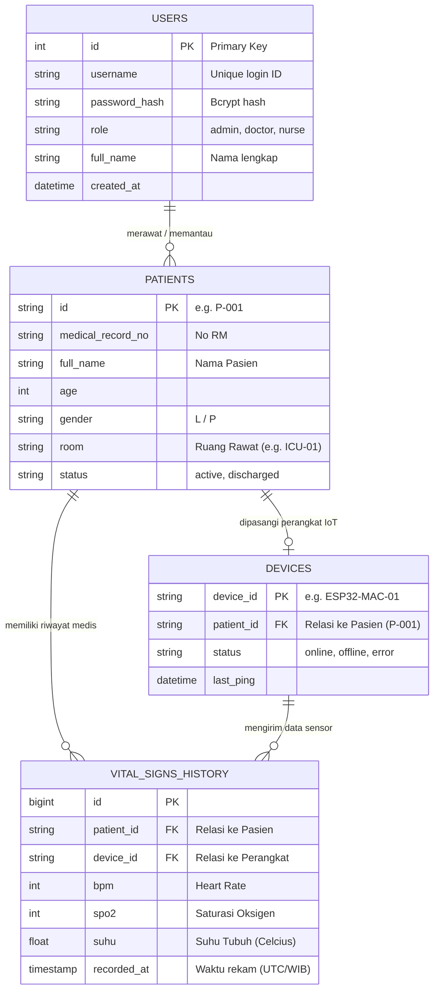

# Rekomendasi Arsitektur & Skema Database (MedIoT Healthcare)

Dokumen ini berisi spesifikasi teknis dan rekomendasi struktur database untuk **Tim B (Backend / API)** dan **Tim C (IoT / Firmware Wokwi)** agar terintegrasi mulus dengan Dashboard Frontend (Tim A).

---

## 1. Rekomendasi Tipe Database

### **Primary Recommendation: PostgreSQL ( dengan TimescaleDB Extension )**
* **Mengapa PostgreSQL + TimescaleDB?**
  1. **Time-Series Data**: Data monitoring tanda vital (Heart Rate, SpO₂, Suhu) dikirim setiap 1–2 detik dari sensor Wokwi/ESP32. TimescaleDB mengoptimalkan operasi query berurutan waktu *(time-series)* dan kompresi data secara dramatis dibanding database relasional biasa.
  2. **Relasi Kuat (ACID)**: Cocok untuk manajemen relasi antara Dokter/Perawat (Users), Pasien, dan Perangkat IoT (Devices).
* **Alternative**: **MySQL 8.0 / MariaDB** atau **MongoDB** (jika lebih memilih skema *document/NoSQL* untuk fleksibilitas payload IoT).

---

## 2. Diagram Relational Entitas (ERD)



---

## 3. Spesifikasi Detail Tabel

### Tabel 1: `users` *(Untuk Sistem Login & Otorisasi)*
Tabel untuk autentikasi pengguna (Dokter, Perawat, dan Admin).

| Kolom | Tipe Data | Keterangan |
| :--- | :--- | :--- |
| `id` | `UUID / BIGSERIAL` | Primary Key |
| `username` | `VARCHAR(50)` | UNIQUE, e.g. `dr_budi`, `perawat_siti` |
| `email` | `VARCHAR(100)` | UNIQUE |
| `password_hash` | `VARCHAR(255)` | Wajib di-hash (Bcrypt / Argon2), **jangan text biasa** |
| `role` | `VARCHAR(20)` | `'admin'`, `'doctor'`, `'nurse'` |
| `full_name` | `VARCHAR(100)` | Nama lengkap (ditampilkan di pojok Sidebar) |
| `created_at` | `TIMESTAMP` | Default: `CURRENT_TIMESTAMP` |

### Tabel 2: `patients` *(Data Pasien)*
Daftar pasien yang dipantau di ICU / ruang perawatan.

| Kolom | Tipe Data | Keterangan |
| :--- | :--- | :--- |
| `id` | `VARCHAR(20)` | Primary Key, e.g. `P-001`, `P-002` (Sesuai ID di UI kita) |
| `medical_record_no` | `VARCHAR(50)` | Nomor Rekam Medis (RM) Rumah Sakit |
| `full_name` | `VARCHAR(100)` | Nama pasien (e.g. "Ahmad Fauzi") |
| `age` | `INTEGER` | Usia pasien |
| `gender` | `VARCHAR(10)` | `'L'` atau `'P'` |
| `room_no` | `VARCHAR(50)` | Nomor Ruang / Bangsal (e.g. "ICU Bed #1") |
| `status` | `VARCHAR(20)` | `'active'` (dirawat), `'discharged'` (pulang) |

### Tabel 3: `devices` *(Registrasi Modul IoT / ESP32 Wokwi)*
Menghubungkan alat IoT ke pasien tertentu.

| Kolom | Tipe Data | Keterangan |
| :--- | :--- | :--- |
| `device_id` | `VARCHAR(50)` | Primary Key, e.g. `ESP32-ICU-01` / MAC Address |
| `patient_id` | `VARCHAR(20)` | Foreign Key ke `patients.id` (`NULL` jika alat nganggur) |
| `status` | `VARCHAR(20)` | `'online'`, `'offline'`, `'maintenance'` |
| `last_seen` | `TIMESTAMP` | Waktu terakhir broker menerima ping dari alat |

### Tabel 4: `vital_signs_history` *(Log Sensor Telemetri)*
Tabel berskema time-series tempat menyimpan log pembacaan sensor.

| Kolom | Tipe Data | Keterangan |
| :--- | :--- | :--- |
| `id` | `BIGSERIAL` | Primary Key |
| `patient_id` | `VARCHAR(20)` | Foreign Key ke `patients.id` (`Indexed` / `Partition Key`) |
| `device_id` | `VARCHAR(50)` | Foreign Key ke `devices.device_id` |
| `bpm` | `SMALLINT` | Denyut Jantung (BPM) |
| `spo2` | `SMALLINT` | Saturasi Oksigen (%) |
| `suhu` | `DECIMAL(4, 2)` | Suhu Tubuh (e.g. `36.85`) |
| `recorded_at` | `TIMESTAMP WITH TIME ZONE` | Waktu perekaman (`Indexed` DESC) |

---

## 4. Standar Alur Data & Spesifikasi API (Tim B & Tim C)

### A. Format Payload MQTT (Tim C - Wokwi/ESP32)
* **Broker Host**: `mqtt-api-healthcare.playgrounds.web.id` (WebSockets Port: `443`/WSS atau `80`/WS, MQTT TCP: `1883`/`8883`)
* **Topic**: `healthcare/patient/vitals`
* **JSON Payload**:
```json
{
  "id": "P-001",
  "bpm": 84,
  "spo2": 98,
  "suhu": 36.75,
  "timestamp": "2026-08-04T07:25:00Z"
}
```

### B. Format Endpoint REST API (Tim B - FastAPI/Node)
* **Base URL**: `https://api-iot-healthcare.playgrounds.web.id`

#### 1. Endpoint Login *(New!)*
* `POST /api/v1/auth/login`
* **Request Body**: `{"username": "dr_budi", "password": "password123"}`
* **Response**:
```json
{
  "status": "success",
  "token": "eyJhbGciOiJIUzI1NiIsInR5cCI6Ik...",
  "user": {
    "id": 1,
    "username": "dr_budi",
    "full_name": "Dr. Budi Santoso",
    "role": "doctor"
  }
}
```

#### 2. Endpoint Riwayat Data
* `GET /api/v1/history/{id_pasien}?limit=50` (e.g. `/api/v1/history/P-001?limit=50`)
* **Response**:
```json
[
  {
    "id": 1045,
    "patient_id": "P-001",
    "bpm": 82,
    "spo2": 99,
    "suhu": 36.6,
    "recorded_at": "2026-08-04T07:24:10Z"
  }
]
```

---

> [!IMPORTANT]
> **Catatan Untuk Tim B (Backend):** Pastikan **CORS (Cross-Origin Resource Sharing)** sudah diaktifkan di server FastAPI untuk domain dashboard kita (maupun `http://localhost:5173` saat pengembangan) agar request fetch tidak diblokir browser!
